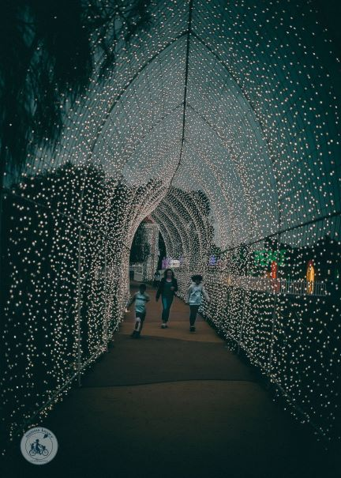

<h3>Go on a winter nature walk at Hammonasset Beach State Park</h3>

Hammonasset Beach State Park is located in Madison.
It's Connecticut's largest shoreline park, and it's open year-round.
During the winter months, you can go on a nature walk and see the park's wildlife.

<h3>Take a romantic horse-drawn carriage ride</h3>

A horse-drawn carriage ride is a great way to see Connecticut during the winter months.
You can find carriage rides in many towns and cities throughout the state.

<h3>Attend the annual Nutcracker Ballet performance</h3>

The Nutcracker Ballet is a holiday tradition in Connecticut.
It's performed by the Hartford Ballet Company every year at the Bushnell Center for the Performing Arts.

<h3>Celebrate the holidays at the Mystic Seaport</h3>

The Mystic Seaport is a maritime museum located in Mystic.
During the holiday season, they host a variety of events including caroling, crafts, and visits with Santa Claus.

<a href="index.html">Home</a> | <a href="more.html">More Info</a>

